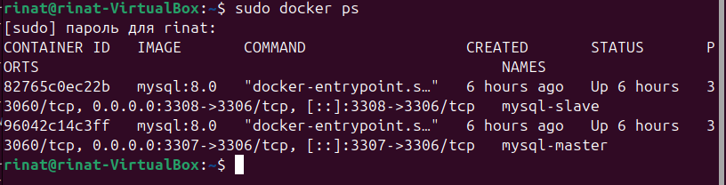
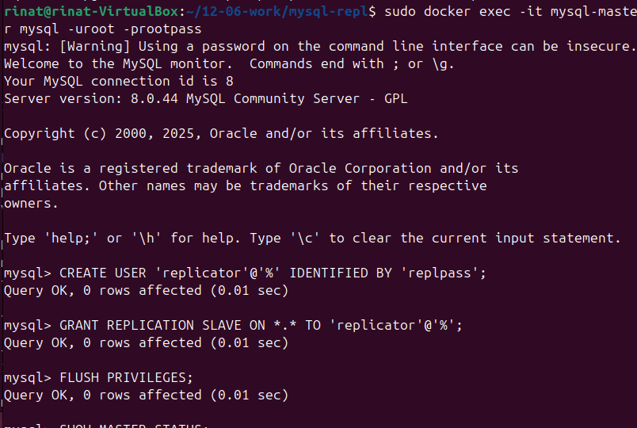
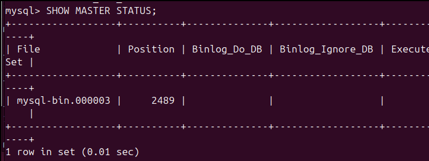
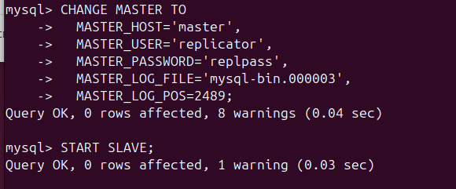
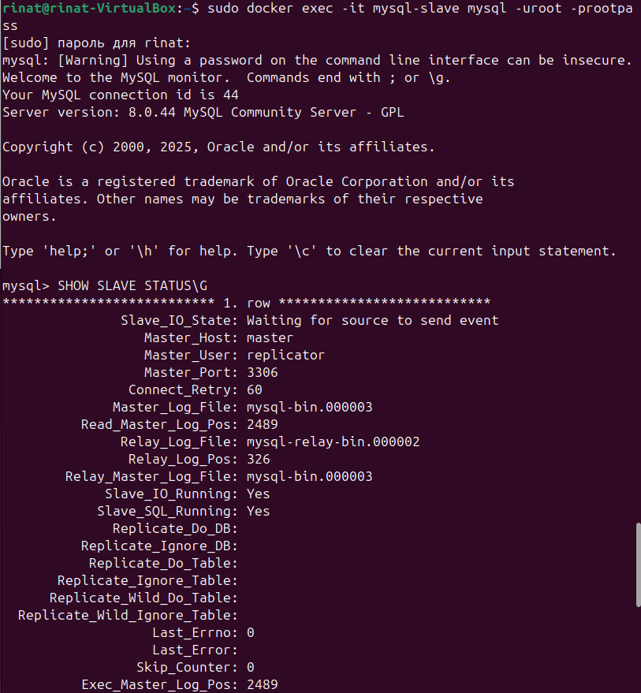
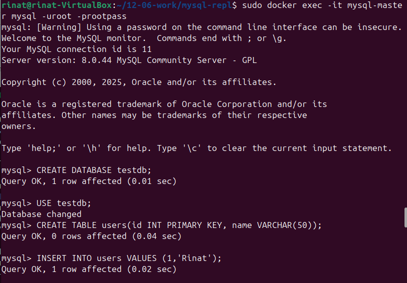
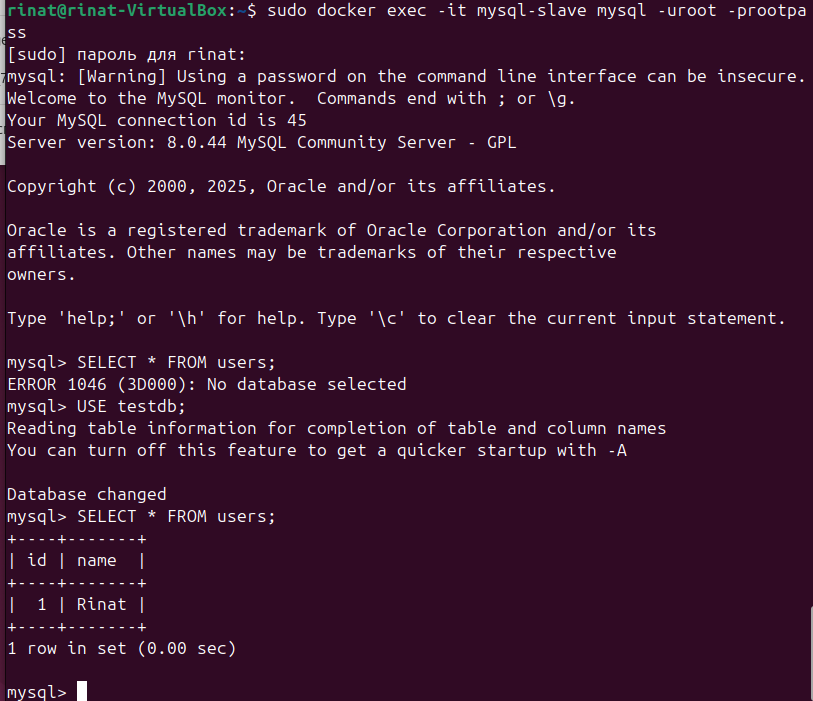

# Домашнее задание к занятию "`Репликация и масштабирование. Часть 1`" - `Серкебаев Ринат`

https://github.com/netology-code/sdb-homeworks/blob/main/12-06.md

### Задание 1 

Разница между режимами репликации master-slave и master-master заключается в следующем:

master-slave - один сервер главный, принимает записи, остальные сервера (slave) читают и получают копию данных. Подходит для распределения нагрузки на чтение. Минус - низка отказоустойчивость, падает master - запись невозможна.

master-master - два или более сервера одновременно принимают записи, синхронизируются друг с другом. Подходит для отказоустойчивой записи и распределенной нагрузки, сложнее настраивается, возможны конфликты при одновременной записи одних и тех же данных.

### Задание 2

1. Были подняты контейнеры баз данных для master и slave.
Файл [docker-compose.yml](docker-compose.yml)
Скриншот docker ps:

2. На master был создан пользователь для репликации с master на slave:

3. Статус master:

4. Настройка, запуск репликации на slave:

5. Проверка статуса slave:

6. Создание БД на master: 

7. Проверка репликации на slave:

